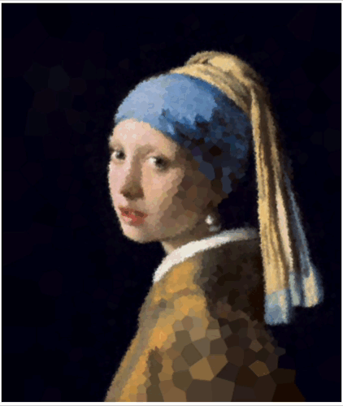

# 들로네를 이용한 이미지 triangle 처리  
들로네 삼각형을 이용한 이미지 이펙트 만들어 보기

## 구현 요약
 - 이미지로드
 - 캔버스를 통해 이미지데이터 추출
 - 이미지 그레이스케일 변환 후 sobel필터를 적용해 외곽라인을 가진 이미지데이터(edgeImageData) 추출
 - edgeImageData에 컬러정보 중 외곽라인에 해당하는 좌표 추출
 - 그레이 스케일 정보를 바탕으로 추출된 좌표에 밀도 조정
 - d3-delaunay를 이용해 polygon으로 표현

## 프로젝트 설정
 - vite
 - react, typescript
 - leva 
  
## 동작샘플

## 참고
 - [voronoi stippling](https://observablehq.com/@drzax/voronoi-stippling)
 - [stippling and TSPs](https://openprocessing.org/sketch/1236886/)

## 후기
 - leva 사용경험
 - vite 설정경험
 - 선언적인 리액트와 canvas를 이용한 이펙트 처리를 위한 코드관리를 고민
   - 이펙트에 다양한 변수가 사용되다 보니 훅은 기능별로 나누기 보단 하나의 훅에서 참조를 여러 개 하게되고 결국 코드 덩어리가 크게 사용되는 느낌을 받음.